## Proteger el kernel (Ubuntu Server)

### ¿Qué hemos hecho?

El kernel es el corazón del sistema operativo. Protegerlo es crítico porque un atacante que consigue comprometer el kernel obtiene control total de la máquina. Las siguientes medidas crean múltiples capas de defensa para que sea prácticamente imposible modificar o explotar el kernel.

---

## Medidas implementadas

| # | Medida | Archivo/Comando | Propósito |
|---|--------|-----------------|-----------|
| 1 | **Permisos boot** | `chmod 600 /boot/vmlinuz-* /boot/initrd.img-*` | Solo root lee kernel/config |
| 2 | **Sysctl hardening** | `/etc/sysctl.d/99-kernel-hardening.conf` | ASLR, kptr_restrict=2, dmesg=1, ptrace=2, BPF off |
| 3 | **hidepid=2** | `mount -o remount,hidepid=2,gid=1001 /proc` | Oculta procesos ajenos |
| 4 | **LKRG** | `modprobe lkrg` + `profile_enforce=1` | **Runtime Guard** vs exploits |
| 5 | **Kernel Lockdown** | `lockdown=integrity` en GRUB | Bloquea módulos no firmados |

---

## Instalación paso a paso

### Medida 1️⃣: Permisos estrictos en /boot

#### ¿Qué hemos hecho?

Hemos cambiado los permisos de los archivos críticos del kernel (`vmlinuz-*`, `initrd.img-*`, `System.map-*`, `config-*`) a modo **600**. Esto significa que **solo el usuario root** puede leer y escribir estos archivos. El resto de usuarios **no pueden ni ver su contenido**.

#### ¿Para qué sirve?

- **vmlinuz-\***: Contiene el binario del kernel. Si un atacante lo modifica, compromete todo el sistema.
- **initrd.img-\***: Imagen de arranque que carga módulos iniciales.
- **System.map-\***: Mapeo de símbolos del kernel (direcciones de funciones, variables globales). Un atacante lo usa para localizar gadgets para ROP exploits.
- **config-\***: Configuración con la que se compiló el kernel. Revela qué características están activadas/desactivadas, facilitando la búsqueda de vulnerabilidades.

**Resultado**: Un usuario local malicioso **no puede** sacar información del kernel que le permita preparar un exploit de escalada de privilegios.

#### Instalación

```bash
sudo chmod 600 /boot/vmlinuz-* /boot/initrd.img-* /boot/System.map-* /boot/config-*
ls -la /boot/ | head -5  # Verificar 600
```

#### Verificación

```bash
ls -la /boot/vmlinuz-*
ls -la /boot/config-*
```

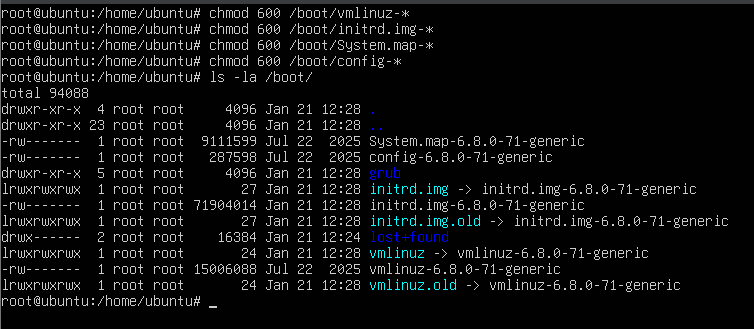

---

### Medida 2️⃣: Sysctl Hardening del kernel

#### ¿Qué hemos hecho?

Hemos creado un archivo de configuración `/etc/sysctl.d/99-kernel-hardening.conf` con **7 parámetros de seguridad críticos** que endurecen el kernel contra técnicas modernas de escalada de privilegios.

#### ¿Para qué sirve cada parámetro?

| Parámetro | Valor | Función |
|-----------|-------|---------|
| `kernel.randomize_va_space` | 2 | **ASLR completo**: Cambias las direcciones de memoria de procesos y kernel en cada arranque. Imposibilita que un exploit adivinee dónde inyectar código. |
| `kernel.kptr_restrict` | 2 | Bloquea la lectura de `/proc/kallsyms` para usuarios no-root. Sin este archivo, un atacante **no tiene un mapa perfecto** del kernel para preparar exploits. |
| `kernel.dmesg_restrict` | 1 | Solo root puede leer el buffer dmesg. Sin esto, logs del kernel filtran direcciones de memoria, offsets, módulos cargados. |
| `kernel.yama.ptrace_scope` | 2 | Solo root puede usar `ptrace()` en otros procesos. Bloquea ataques donde un proceso se "engancha" a otro para leer su memoria o inyectar código. |
| `kernel.unprivileged_bpf_disabled` | 1 | Desactiva **eBPF** para usuarios sin privilegios. BPF es un motor de scripts dentro del kernel y ha sido puerta de entrada a muchas escaladas. |
| `kernel.kexec_load_disabled` | 1 | Bloquea `kexec` (cargar un nuevo kernel sin reiniciar). Un atacante no puede reemplazar el kernel en tiempo de ejecución. |
| `kernel.unprivileged_userns_clone` | 0 | Prohíbe crear `user namespaces` sin ser root. Los contenedores falsos (unprivileged containers) son una técnica moderna de escalada. |

#### Instalación

```bash
# Crear el archivo de configuración
sudo tee /etc/sysctl.d/99-kernel-hardening.conf << EOF
kernel.randomize_va_space = 2
kernel.kptr_restrict = 2
kernel.dmesg_restrict = 1
kernel.yama.ptrace_scope = 2
kernel.unprivileged_bpf_disabled = 1
kernel.kexec_load_disabled = 1
kernel.unprivileged_userns_clone = 0
EOF

# Aplicar la configuración inmediatamente
sudo sysctl --system
```

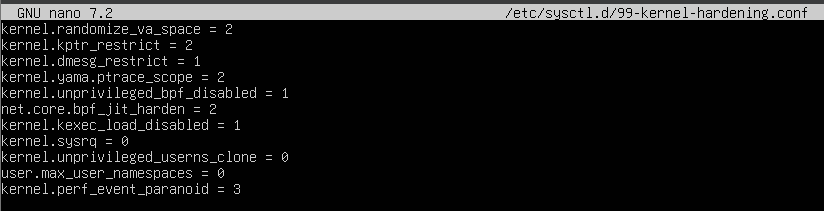

#### Verificación

```bash
# Verificar que los cambios se aplicaron deben salir 2 en estos:
sysctl kernel.kptr_restrict          
sysctl kernel.yama.ptrace_scope      
sysctl kernel.randomize_va_space     
```

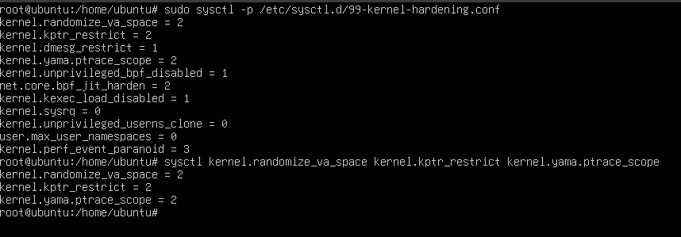

---

### Medida 3️⃣: Montaje de /proc con hidepid=2

#### ¿Qué hemos hecho?

Hemos remontado el sistema de archivos `/proc` (que lista todos los procesos) con la opción **hidepid=2**. Esto oculta los procesos de otros usuarios.

#### ¿Para qué sirve?

- **Sin hidepid=2**: Un usuario normal puede hacer `ps aux` y ver **todos los procesos del sistema**, incluyendo los de otros usuarios. Esto facilita el reconocimiento: "¿Qué servicios se ejecutan?", "¿Cuál es el PID del proceso X?", "¿Cuáles son sus argumentos?".

- **Con hidepid=2**: Un usuario normal **solo ve sus propios procesos**. Los procesos de otros usuarios (incluyendo root) son completamente invisibles. Solo el usuario root o los usuarios en el grupo `procadmins` ven todo.

**Resultado**: Un atacante local no puede enumerar fácilmente qué servicios corren (Apache, SSH, Nginx, etc.) ni obtener PIDs para ataques dirigidos.

#### Instalación

```bash
# Crear un grupo especial (opcional pero recomendado)
sudo groupadd -f procadmins

# Agregar tu usuario al grupo (reemplaza $USER con tu usuario si es necesario)
sudo usermod -aG procadmins $USER

# Remontar /proc con hidepid=2
sudo mount -o remount,hidepid=2,gid=$(getent group procadmins | cut -d: -f3) /proc

# Hacer permanente: editar /etc/fstab
sudo nano /etc/fstab
# Agregar o modificar la línea de /proc:
# proc    /proc    proc    defaults,hidepid=2,gid=procadmins    0    0
```

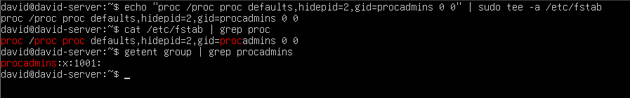

#### Verificación

```bash
# Verificar que hidepid=2 está activo
mount | grep proc

# Ejemplo de salida esperada:
# proc on /proc type proc (rw,nosuid,nodev,noexec,relatime,hidepid=2)
```

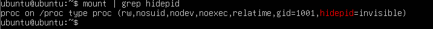

---

### Medida 4️⃣: LKRG (Linux Kernel Runtime Guard) **EXTRA**

#### ¿Qué hemos hecho?

Hemos compilado e instalado **LKRG**, un módulo del kernel que actúa como un "guardia en tiempo de ejecución". Monitorea continuamente la integridad del kernel y detecta patrones típicos de exploits.

#### ¿Para qué sirve?

LKRG está diseñado para **detectar y detener escaladas de privilegios incluso si la vulnerabilidad existe**. Monitorea:

- **Cambios ilegales en credenciales de procesos** (uid/gid/capabilities). Si un proceso intenta cambiar de user sin pasar por el camino correcto, LKRG lo mata.
- **Manipulación de estructuras críticas del kernel** (task_struct, cred, etc.).
- **Desviaciones de flujo de ejecución** (ROP, JOP exploits).
- **Intentos de cargar código malicioso**.

**Resultado**: Incluso si un explorador pueda ejecutar código en el kernel, LKRG lo detiene antes de que cause daño.

#### Instalación

```bash
# 1. Instalar dependencias
sudo apt update && sudo apt upgrade -y
sudo apt install git build-essential linux-headers-$(uname -r) dkms

# 2. Preparar GRUB (LKRG necesita que module.sig_enforce esté desactivado)
sudo nano /etc/default/grub

# Busca la línea GRUB_CMDLINE_LINUX_DEFAULT y modifica a:
# GRUB_CMDLINE_LINUX_DEFAULT="quiet splash lockdown=integrity proc_hidepid=2"

# Alternativa: usar sed (cuidado)
sudo sed -i 's/GRUB_CMDLINE_LINUX_DEFAULT="quiet splash"/GRUB_CMDLINE_LINUX_DEFAULT="quiet splash lockdown=integrity proc_hidepid=2"/' /etc/default/grub

# Aplicar cambios en GRUB
sudo update-grub

# 3. Descargar, compilar e instalar LKRG
cd /tmp
git clone https://github.com/lkrg-org/lkrg.git
cd lkrg

# Compilar (esto toma 2-5 minutos)
make

# Instalar (genera archivos en /lib/modules, prepara dkms)
sudo make install

# 4. Configurar LKRG en modo enforcement (mata procesos maliciosos)
echo "options lkrg profile_enforce=1" | sudo tee /etc/modprobe.d/lkrg.conf

# 5. Actualizar módulos del kernel
sudo depmod -a

# 6. Reiniciar para que LKRG se cargue en el arranque
sudo reboot
```

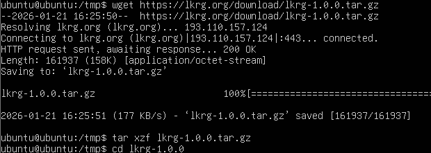

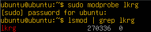


#### Verificación (después de reboot)

```bash
# Ver si LKRG está cargado
lsmod | grep lkrg

# Salida esperada:
# lkrg                  425984  0

# Ver estado del servicio (si existe)
systemctl status lkrg 2>/dev/null || echo "Sin servicio systemd"
```

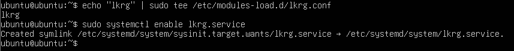

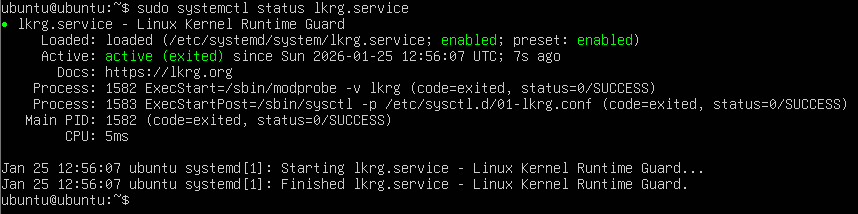

---

### Medida 5️⃣: Kernel Lockdown

#### ¿Qué hemos hecho?

Hemos activado el modo **lockdown=integrity** en el parámetro de arranque del kernel (via GRUB). Este es un mecanismo de seguridad integrado en kernels modernos (Ubuntu 5.4+).

#### ¿Para qué sirve?

El modo lockdown añade una **política de seguridad adicional** que restringe incluso a root para hacer cosas peligrosas:

- **Bloquea carga de módulos no firmados** (solo módulos firmados por Ubuntu pueden cargarse).
- **Limita acceso a `/dev/mem` y `/dev/kmem`** (no se puede escribir directamente en la memoria del kernel).
- **Bloquea técnicas de modificación de código en tiempo de ejecución** (kprobes, ftrace en modo no seguro, etc.).

Existen dos modos:
- **integrity**: Protege contra escrituras en kernel. Es el recomendado.
- **confidentiality**: Además protege contra **lecturas** de memoria del kernel (más restrictivo).

**Resultado**: Un atacante con privilegios de root **aún así no puede** modificar el kernel o cargar un rootkit.

#### Instalación

Ya se realizó en el paso anterior cuando editamos `/etc/default/grub`:

```bash
# Verificar que está activo
cat /sys/kernel/security/lockdown

# Salida esperada: [integrity]
```

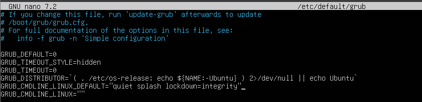

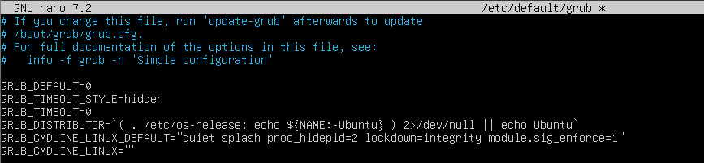

Si necesitas verificar o cambiar:

```bash
# Ver el estado actual
cat /sys/kernel/security/lockdown

# Si no dice "integrity", editar GRUB:
sudo nano /etc/default/grub
# Y asegurar que incluye: lockdown=integrity
# Ejemplo: GRUB_CMDLINE_LINUX_DEFAULT="quiet splash lockdown=integrity"

sudo update-grub
sudo reboot
```

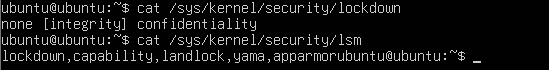

---